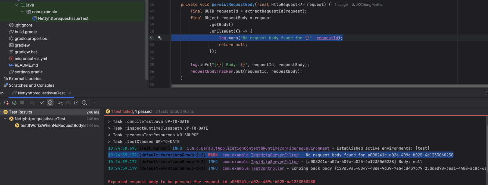

## Issue with Micronaut's NettyHttpRequest.getBody() [Issue #12591](https://github.com/micronaut-projects/micronaut-core/issues/12591)
This repo demonstrates that `NettyHttpRequest.getBody()` returns an empty body even when the original HTTP request 
does indeed contain a body. This is evidenced through the running of the test [canAccessGetBodyOfNettyHttpRequest](src/test/java/com/example/NettyhttprequestIssueTest.java).

Running the test and seeing the log "No request body found for..." demonstrates that `NettyHttpRequest.getBody()` returns an empty body

This also affects `NettyHttpRequest.toMutableRequest()` since the implementation of that method depends on `getBody()` as seen [here](https://github.com/micronaut-projects/micronaut-core/blob/5.0.x/http/src/main/java/io/micronaut/http/HttpRequest.java#L469-L483)